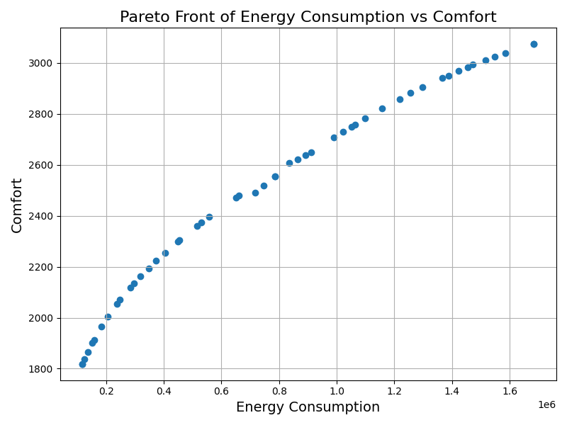

# Example

Case study with a simple heating system [SimpleHeatingSystem.mo](./SimpleHeatingSystem.mo) built in Modelica.

The idea is to heat a room, when the room heats faster, human beings feels more comfortable, but the energy consumption and cost become higher. This system should be optimized to find the **trade-off of energy consumption and comfort**.

hyperparameters (these are the parameters to be varied): 

```
  parameter Real Q_max = 5000 "Maximum heating power in watts";
  parameter Real T_set = 293.15 "Setpoint temperature in Kelvin";
```

A Python script [Optimize_SimpleHeatingSystem.py](./Optimize_EnergySystem.py) to perform hyperparameter optimization.

**Procedure:**

<u>1. Configuration of global setting for the optimization</u>

<u>2. Run Python script: `python optimize_main.py`</u>

You will see 

* the models have been loaded in different workers for parallel computing
* parameters have been set for different models
* simulated results of each model

like this:

```shell
Load model result in worker: True
Load model result in worker: True
Load model result in worker: True
Load model result in worker: True
Load model result in worker: True

Parameters set: {'Q_max': 1889.86, 'T_set': 307.42}
Parameters set: {'Q_max': 4459.37, 'T_set': 282.12}
Parameters set: {'Q_max': 3851.85, 'T_set': 298.54}
Parameters set: {'Q_max': 2924.46, 'T_set': 280.58}
Parameters set: {'Q_max': 1375.1, 'T_set': 282.02}

Simulation results: {'energy': 1513678.09, 'cost': 151367.81, 'comfort': 1255.39}
Simulation results: {'energy': 1054423.49, 'cost': 105442.35, 'comfort': 2203.89}
Simulation results: {'energy': 220875.05, 'cost': 22087.51, 'comfort': 664.14}
Simulation results: {'energy': 1054423.49, 'cost': 105442.35, 'comfort': 2203.89}
Simulation results: {'energy': 281742.21, 'cost': 28174.22, 'comfort': 1317.24}
```

The simulation is runing:

```shell
==========================================================
n_gen  |  n_eval  | n_nds  |      eps      |   indicator
==========================================================
     1 |        5 |      2 |             - |             -
     2 |       10 |      2 |  5.7876254181 |         ideal
     3 |       15 |      3 |  0.9710601290 |         ideal
     4 |       20 |      2 |  1.1370485530 |         ideal
     5 |       25 |      2 |  0.1184009363 |         ideal
```

You will see the results at the end of simulation like this:

```shell
Optimization Results:
Solution 0: Energy = 140592.49, Cost = 14059.25, Comfort = 517.23,
Solution 1: Energy = 119249.50, Cost = 11924.95, Comfort = 555.79,
```

After that you will see the result of Pareto Front. The top left results is what we want.

