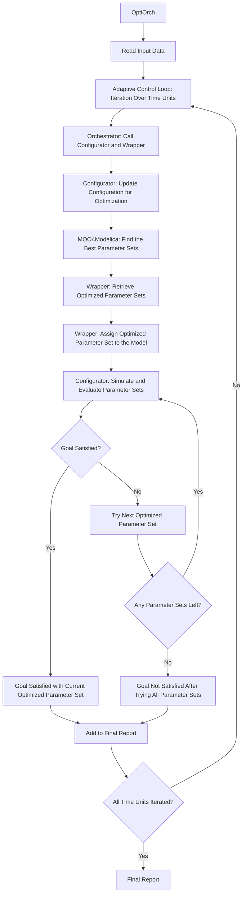

# Dynamic Adaptation and Orchestration of Modelica Simulation

An orchestration workflow for simulating and optimizing self-adaptive systems with MOO4Modelica.  

The system dynamically adjusts its operational parameters based on available resources and specific goals, aiming to meet defined objectives.

## Components

The orchestration workflow consists of four main components, besides the Modelica model, input data, and the MOO4Modelica optimization framework:

* `orchestration_config.json`: configuration file for the entire orchestration workflow.
  * It also dynamically adapts the MOO4Modelica config file (`config.py`).
* `orchestrator.py`: Coordinates the overall workflow.
  * Initializes components, reads data, runs the optimization, and manages the simulation and evaluation loop.
* `orchestration_wrapper.py`:  Intermediary between MOO4Modelica and the orchestration workflow. 
  * Manages the optimization process using MOO4Modelica, handles optimization results, and provides parameter sets for simulation.
* `orchestration_configurator.py`: Updates configuration based on current status.
  * Prepares and sets parameters for simulation.

## Orchestration Workflow (Flowchart)
