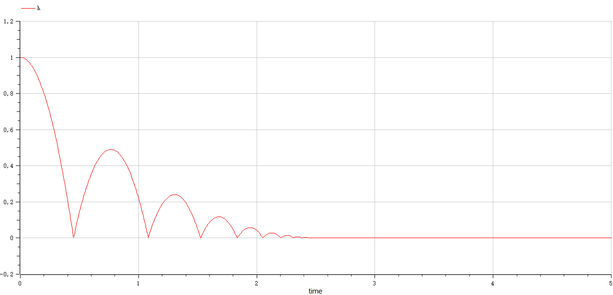

# Preliminary Knowledge: OMPython

This shows an example of using OMPython to simulate a Modelica model

OMPython: OpenModelica Python Interface

## Requirements:

- Python (add to PATH)
- OpenModelica (add to PATH)
- OMPython (`pip install OMPython`)

This is what the PATH looks like:

```
%USERPROFILE%\AppData\Local\Programs\Python\Python312\
%USERPROFILE%\AppData\Local\Programs\Python\Python312\Scripts
%USERPROFILE%\OpenModelica1.22.3-64bit\bin
```

## Example:

Use Python script [Simulate_BouncingBall.py](./Simulate_BouncingBall.py) to simulate the Modelica model [BouncingBall.mo](./BouncingBall.mo)

## Procedure:

Run `python Simulate_BouncingBall.py`

You will see the messages like this:

```shell
Modelica model file found: C:\Users\wang\Documents\Dev\MOO4Modelica\BouncingBall.mo
Load result: True
Model loaded sucessfully
Model instantiated successfully
Compile result: ('C:/Users/wang/Documents/Dev/MOO4Modelica/BouncingBall', 'BouncingBall_init.xml')
Model compiled successfully
Simulate result: {'resultFile': 'C:/Users/wang/Documents/Dev/MOO4Modelica/BouncingBall_res.mat', 'simulationOptions': "startTime = 0.0, stopTime = 5.0, numberOfIntervals = 500, tolerance = 1e-06, method = 'dassl', fileNamePrefix = 'BouncingBall', options = '', outputFormat = 'mat', variableFilter = '.*', cflags = '', simflags = ''", 'messages': 'LOG_SUCCESS       | info    | The initialization finished successfully without homotopy method.\nLOG_SUCCESS       | info    | The simulation finished successfully.\n', 'timeFrontend': 0.0301269, 'timeBackend': 0.00737, 'timeSimCode': 0.0021141, 'timeTemplates': 0.0575072, 'timeCompile': 10.6942393, 'timeSimulation': 0.3945144, 'timeTotal': 11.187029}
Simulation completed
Plot result: True
Plot completed
```

After that you will see the simulation result: