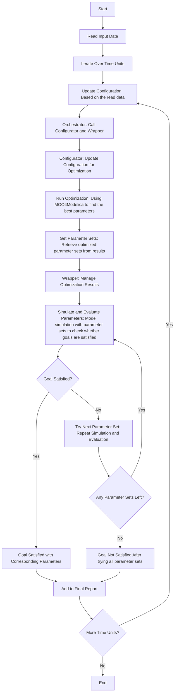

# Dynamic Adaptation and Orchestration of Systems with Modelica and MOO4Modelica

An orchestration workflow for simulating and optimizing self-adaptive systems with MOO4Modelica.  

The system dynamically adjusts its operational parameters based on available resources and specific goals, aiming to meet defined objectives.

## Components

The orchestration workflow consists of four main components, besides the Modelica model, input data, and the MOO4Modelica optimization framework:

* `orchestration_config.json`: configuration file for the entire orchestration workflow.
  * It also dynamically adapts the MOO4Modelica config file (`config.py`).
* `orchestrator.py`: Coordinates the overall workflow.
  * Initializes components, reads data, runs the optimization, and manages the simulation and evaluation loop.
* `orchestration_wrapper.py`:  Intermediary between MOO4Modelica and the orchestration workflow. 
  * Manages the optimization process using MOO4Modelica, handles optimization results and provides parameter sets for simulation.
* `orchestration_configurator.py`: Updates configuration based on current context.
  * Prepares and sets parameters for simulation.

## Orchestration Workflow (Flowchart)

## Case Study: Self-adaptive Edge Computing System

### Objective

To develop a self-sufficient edge computing system powered by PV, capable of dynamically adjusting its **CPU cores** and **frequency** based on **available energy** and **user demand**. 

The system aims to meet **user demand** while **remaining energy** ≥ 0 for each time unit.

### Input

* Energy available (time unit: hour)

* User demand (time unit: hour)

### Goals:

  - **Meet User Demand:** Ensure the system provides the required **performance** (computing resource the system can provides) to meet **user demand** (computing resource the user needs). 
    - User demand satisfied when **performance** ≥ **user demand**.

  - **Maximize Energy Efficiency:** Optimize the use of energy consumption to prolong system operation and efficiency.
    - **remaining energy** should be ≥ 0 at the end of simulation

### Outcome 

A dynamically self-adaptive edge computing system that efficiently manages its resources based on **available energy** and **user demand** for each time unit (hour), ensuring sustainable and efficient operation for autonomous vehicles requiring edge computing capabilities.

### File Structure

```shell
/src
  |-- MOO4Modelica
  	|-- config.json
  	|-- config.py
  	|-- optimize_main.py
  	|-- parallel_computing.py
  	|-- optimization_libraries.py
  |-- OrchestrationWorkflow
      |-- ITSystem.mo  # Modelica model
      |-- energy_available_and_user_demand_data.txt  # input data
      |-- orchestration_config.json  # config file of the orchestration workflow
      |-- orchestrator.py
      |-- orchestration_wrapper.py
      |-- orchestration_configurator.py
```

### Steps

**Step 1:** Set up the configuration in `orchestration_config.json`:

```json
{
    "DATA_FILE_PATH": "energy_available_and_user_demand_data.txt",
    "CONFIG_PATH": "config.json",
    "MODEL_FILE": "ITSystem.mo",
    "MODEL_NAME": "ITSystem",
    "SIMULATION_TIME": 100,
    "START_TIME": 8,
    "END_TIME": 13,
    "TIME_UNIT": "hour",
    "OPTIMIZATION_PARAMETERS": {
        "activeCores": {
            "bounds": [1, 4],
            "type": "int"
        },
        "cpuFrequency": {
            "bounds": [1.0, 3.0],
            "type": "float"
        }
    },
    "EVALUATION_PARAMETERS": {
        "performance": "performance",
        "remaining_energy": "remainingEnergy",
        "energy_consumption": "energyConsumption"
    },
    "INPUT_PARAMETERS": {
        "available_energy": "availableEnergy",
        "user_demand": "userDemand"
    },
    "CRITERIA": {
        "GOAL_EXPRESSION": 
        "evaluation_results['performance'] >= simulation_inputs['user_demand']"
    }
}
```

**Step 2:** run `python orchestrator.py`:

```shell
Processing hour: 8  # 8 am
Parameters set: {'activeCores': 4, 'cpuFrequency': 2.47}
Performance: 988.34  # at 8 am user demand is high, the evaluated performance is 988.34 which satisfies user demand
User demand satisfied.

...

Processing hour: 12  # 12 am
Parameters set: {'activeCores': 2, 'cpuFrequency': 1.86}
Performance: 372.13  # # at 12 am user demand is medium, the evaluated performance is 372.13 which satisfies user demand
User demand satisfied.

Final Report:
Hour 8: User demand satisfied with configuration {'activeCores': 4, 'cpuFrequency': 2.47}.

...

Hour 12: User demand satisfied with configuration {'activeCores': 2, 'cpuFrequency': 1.86}.
```