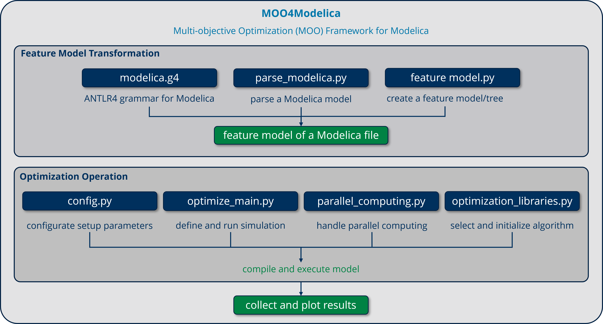

# MOO4Modelica

Multi-objective Optimization framework for Modelica.

GitLab Repo: [https://git-st.inf.tu-dresden.de/wang/MOO4Modelica](https://git-st.inf.tu-dresden.de/wang/MOO4Modelica)



#### Highlights:

1. **Easy to configure:** All settings and configurations can be defined in `config.py`.
2. **SoTA libraries and algorithms for MOO:** Support different libraries and algorithms.
3. **Enable using of** **parallel computing**: For accelerated process. 
4. **Support transformation into feature models**: To better analyze and understand large-scale models.
5. **Comprehensive debugging system**: Debugging functions for all critical steps.

#### Structure:

```
./src/ 
(Feature Model Transformation)
	|-- modelica.g4
	|-- parse_modelica.py
	|-- feature_model.py
(Optimization Operation)
	|-- config.py 
	|-- optimize_main.py 
	|-- parallel_computing.py
	|-- optimization_libraries.py 
```

* (Feature Model Transformation)
  * `modelica.g4`: an ANTLR4 grammar for Modelica files
  * `parse_modelica.py`: parse a Modelica model to extract it components and their parameters
  * `feature_model.py`: create a feature model and add the extracted components
* (Optimization Operation)
  * `config.py`: global settings and configurations
  * `optimize_main.py`: main optimization script
  * `parallel_computing.py`: parallel_computing
  * `optimization_libraries`: initialization libraries and algorithms