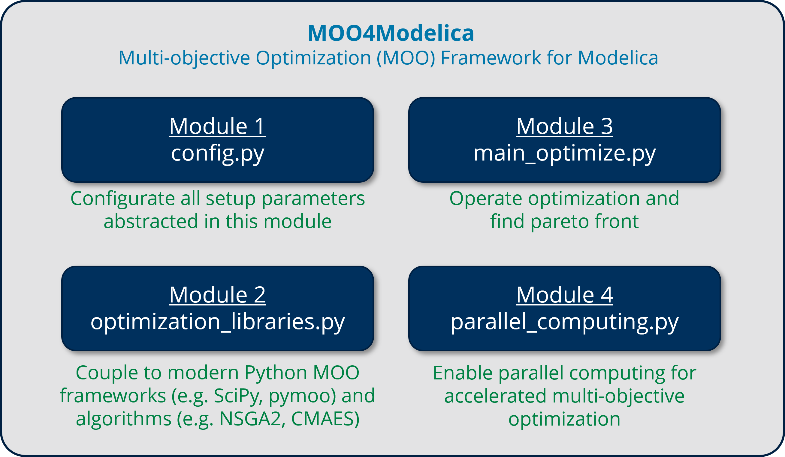
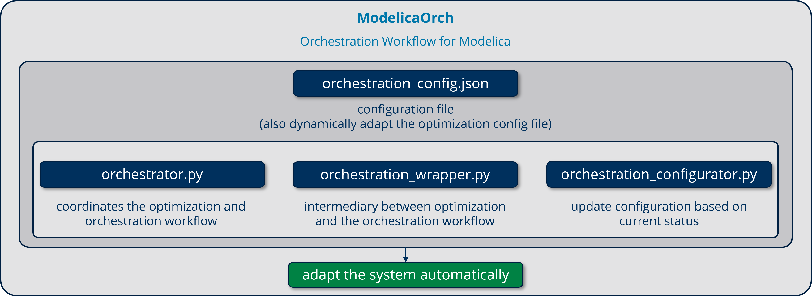

# OptiOrch

A toolchain which integrates the optimization framework "MOO4Modelica" and the orchestration workflow "ModelicaOrch" to achieve optimal control in Modelica-based simulations.

GitLab Repo: [https://git-st.inf.tu-dresden.de/wang/MOO4Modelica](https://git-st.inf.tu-dresden.de/wang/MOO4Modelica)





#### Structure:

```
./src/ 
(Feature Model Transformation)
	|-- feature_model
		|-- modelica.g4
		|-- parse_modelica.py
		|-- feature_model.py
(Optimization Operation)
	|-- config.json
	|-- config.py
	|-- optimize_main.py 
	|-- parallel_computing.py
	|-- optimization_libraries.py
(Orchestration Workflow)
	|-- orchestration_config.json
	|-- orchestrator.py
	|-- orchestration_wrapper.py
	|-- orchestration_configurator.py
```

* **Feature Model Transformation**
  * `modelica.g4`: an ANTLR4 grammar for Modelica files
  * `parse_modelica.py`: parse a Modelica model to extract it components and their parameters
  * `feature_model.py`: create a feature model and add the extracted components
* **Optimization Operation**
  * `config.json` & `config.py`: global settings and configurations
  * `optimize_main.py`: main optimization script
  * `parallel_computing.py`: parallel computing
  * `optimization_libraries.py`: dynamic import of algorithms from *pymoo*

* **Orchestration Workflow**
  * `orchestration_config.json`: configuration file for the entire orchestration workflow
  * `orchestrator.py`: coordinates the overall workflow
  * `orchestration_wrapper.py`: intermediary between MOO4Modelica and orchestration workflow
  * `orchestration_configurator.py`: updates configuration based on current status